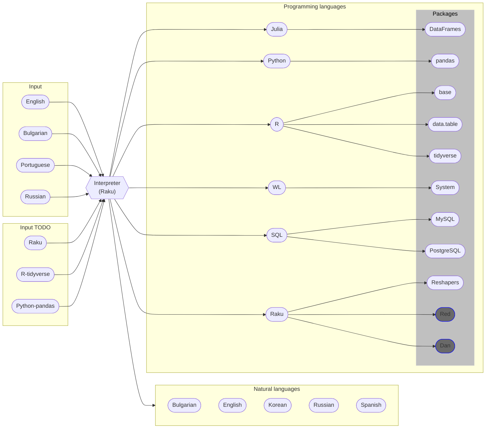

```mermaid
flowchart LR

    %% Left: input DSLs / query languages
    eng_in([English])
    bul_in([Bulgarian])
    port_in([Portuguese])
    rus_in([Russian])

    raku_dsl([Raku])
    r_tidy([R-tidyverse])
    py_pandas([Python-pandas])

    %% Center: interpreter
    interp{{"Interpreter<br/>(Raku)"}}

    %% Right: target languages
    julia([Julia])
    py([Python])
    r([R])
    wl([WL])
    sql([SQL])
    raku_out([Raku])

    %% Rightmost: libraries / back-ends
    df([DataFrames])
    pandas([pandas])
    r_base([base])
    r_datatable([data.table])
    r_tidyverse([tidyverse])
    wl_system([System])
    mysql([MySQL])
    postgres([PostgreSQL])
    reshapers([Reshapers])
    red([Red])
    dan([Dan])

    %% Sources
    subgraph sources["Input"]
        eng_in
        bul_in
        port_in
        rus_in
    end

    %% Sources TODO
    subgraph sources-todo["Input TODO"]
        raku_dsl
        r_tidy
        py_pandas
    end

    %% Bottom: translations box
    subgraph spoken_translations["Natural languages"]
        bul_out([Bulgarian])
        eng_out([English])
        kor_out([Korean])
        rus_out([Russian])
        spa_out([Spanish])
    end

    %% Edges from DSLs to interpreter
    eng_in --> interp
    bul_in --> interp
    port_in --> interp
    rus_in --> interp
    raku_dsl --> interp
    r_tidy --> interp
    py_pandas --> interp

    %% Edges from interpreter to target langs and translations
    interp --> julia
    interp --> py
    interp --> r
    interp --> wl
    interp --> sql
    interp --> raku_out
    interp --> spoken_translations

    %% Edges from target langs to back-ends
    julia --> df
    py --> pandas
    r --> r_base
    r --> r_tidyverse
    r --> r_datatable
    wl --> wl_system
    sql --> mysql
    sql --> postgres
    raku_out --> reshapers
    raku_out --> red
    raku_out --> dan

    subgraph translations["Programming languages"]
        julia
        py
        r
        wl
        sql
        raku_out

        subgraph packages["Packages"]
            df
            pandas
            r_base
            r_datatable
            r_tidyverse
            wl_system
            mysql
            postgres
            reshapers
            red
            dan
        end
    end

    %% ---- Styling ----

    %% Light gray background for packages
    style packages fill:silver,stroke:#cccccc,color:#000

    %% Dashed borders for Dan and Red
    style dan stroke:blue, fill:dimgray
    style red stroke:blue, fill:dimgray
```